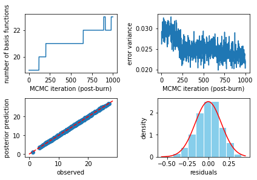

In this example, we generate data from the Friedman function at fit a model with pyBASS.


```python
import pyBASS as pb
import numpy as np
import matplotlib.pyplot as plt
```


```python

# Friedman function (Friedman, 1991, Multivariate Adaptive Regression Splines)
def f(x):
    return (10. * np.sin(np.pi * x[:, 0] * x[:, 1]) + 20. * (x[:, 2] - .5) ** 2 
            + 10 * x[:, 3] + 5. * x[:, 4])


n = 500 # sample size
p = 10 # number of predictors (only 5 are used)
x = np.random.rand(n, p) # training inputs
xx = np.random.rand(1000, p) # test inputs
y = f(x) + np.random.normal(size=n) * 0.1 # noisy training outputs
ytest = f(xx) + np.random.normal(size=1000) * 0.1 # noisy test outputs

```

Fit the BMARS model with and see the results with


```python
mod = pb.bass(x, y)
mod.plot()
```

    BASS MCMC Complete. Time: 3.382453 seconds.


    

    


The following gives the posterior predictions of the BMARS mean model.


```python
pred = mod.predict(xx)
plt.scatter(f(xx), pred.mean(axis=0)) # posterior mean prediction vs noisless test outputs
plt.show()
```


    

    


To get full prediction uncertainty, use the nugget=True option.  For instance, below we predict at just one new input setting.  The distribution of predictions represents both uncertainty in the BMARS mean as well as predictive variance (e.g., measurement error).


```python
pred_1obs = mod.predict(xx[0], nugget=True)
plt.hist(pred_1obs)
plt.axvline(ytest[0], color='red')
plt.show()
```


    

    


We can calculate the empirical coverage of the uncertainty from our test set predictions by forming a probability interval for each prediction (in this case, 95%), and counting how many intervals capture the corresponding true values.


```python
pred_obs = mod.predict(xx, nugget=True)
quantiles = np.quantile(pred_obs, [0.025, .975], axis=0)
np.mean((quantiles[0] < ytest) * (quantiles[1] > ytest))
```


    0.931


